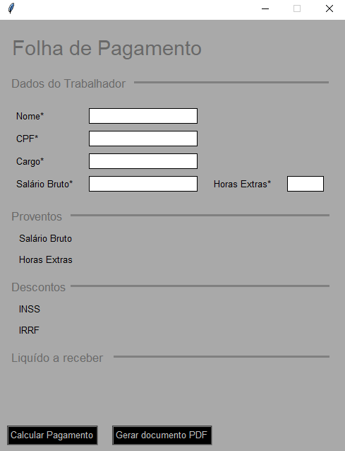
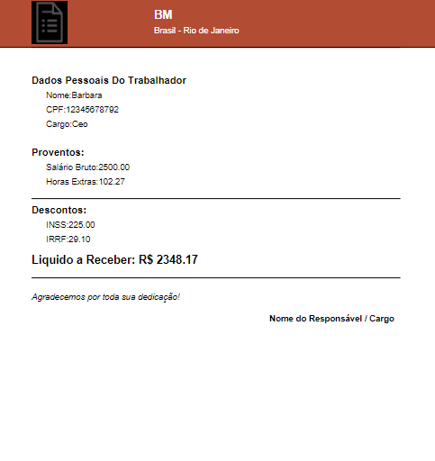

<h1 align="Center">
    
    <p>💸Many know how to make money, but few know how to spend it.💸</p>
</h1>

## | 🚩 Indexes
- [About](#-About)
- [Intention](#-Intention)
- [Tools](#-Tools)
- [How Contribute](#-How-Contribute)
- [License](#-License)

## | 📖 About
<h2 style="font-family: Arial; font-size:16px"><u>Payroll</u> is a project that will help calculate the final amount to be received in payment. INSS and IRRF discounts are already included.</h2>

## | 💡 Intention
<h2 style="font-family: Arial; font-size:16px">This project was created to help and facilitate the calculation and detailed recording of each individual's remuneration. Including: salaries, deductions, discounts, commissions and others. Allowing the generation of PDFs or finalization.</h2>

## | 👩‍💻 Tools
<h2 style="font-family: Arial; font-size:16px">
<ul>
    <a href="https://docs.python.org/pt-br/3/"><li>Python</li></a>
    <a href="https://docs.python.org/pt-br/dev/library/tkinter.html "><li>Tkinter</li></a>
    <a href="https://docs.reportlab.com/reportlab/userguide/ch1_intro/"><li>ReportLab</li></a>
    <a href="https://docs.python.org/pt-br/3.8/library/locale.html"><li>Locale</li></a>
</ul>
</h2>

## | ⚙ How Contribute

```bash
    # Clone the project
    $ git clone https://github.com/barbaram02/folhaDePpagamento
```

```bash
    # Enter Directory
    $ cd folhadepagamentopython
```

```bash
    # Install the dependencies, if use npm
    $ npm install
```

<p style="font-family: Arial; font-size:16px"> OR </p>

```bash
    # Install the dependencies, if use npm
    $ yarn
```

## | 🧾 License
<h2 style="font-family: Arial; font-size:16px">This project is under the MIT license. Find out more through the archive <a href="https://github.com/barbaram02/folhaDePpagamento/blob/main/LICENSE">LICENSE.</a> </h2>

## | 📸 Images


<hr>

